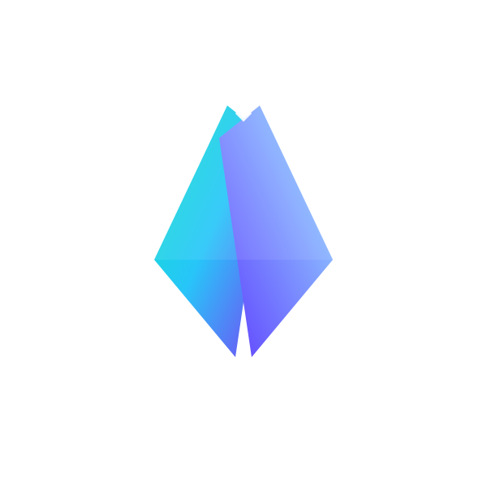

<p align="center">
  
</p>

<h1 align="center">🌌 Slenix Framework</h1>

<p align="center">Um micro framework PHP leve, elegante e poderoso baseado no padrão MVC</p>

<p align="center">
  <a href="https://github.com/claudiovictors/slenix"></a>
  <a href="https://packagist.org/packages/slenix/slenix"></a>
  <a href="https://github.com/claudiovictors/slenix/blob/main/LICENSE"></a>
  
</p>

---

## 📖 Sobre o Slenix

O **Slenix Framework** é um micro framework PHP projetado para desenvolvedores que buscam **simplicidade**, **desempenho** e **flexibilidade**.  
Baseado na arquitetura **MVC (Model-View-Controller)**, ele oferece ferramentas essenciais para construir aplicações web e APIs de forma rápida e eficiente.

### ✨ Recursos Principais

- 🚀 **Roteamento Simples**: Defina rotas dinâmicas com parâmetros e grupos.
- 🗃️ **ORM Integrado**: Gerencie bancos de dados com modelos intuitivos.
- 🎨 **Template Luna**: Crie views dinâmicas com sintaxe limpa e poderosa.
- 🛠️ **Celestial CLI**: Automatize a criação de Models, Controllers e inicialização do servidor.
- ⚡ **Leve e Rápido**: Sem dependências pesadas, ideal para projetos de pequeno a médio porte.
- 📤 **Upload de Arquivos**: Suporte simplificado para upload de arquivos.
- 🌐 **Requisições HTTP**: Integração robusta com a classe `HttpClient` para consumir APIs.
- 🔒 **Middlewares**: Controle de autenticação, CSRF, JWT e muito mais.

---

## 📋 Pré-requisitos

- 🐘 **PHP**: 8.0 ou superior
- 🗄️ **Extensão PDO**: Habilitada (necessária para o ORM)
- 📦 **Composer**: Recomendado para autoload
- 🌍 **Servidor Web**: Apache, Nginx ou servidor embutido do PHP (`celestial serve`)

---

## ⚙️ Instalação

### 1️⃣ Instalar via Composer

```bash
composer require slenix/slenix
```

### 2. Clonar o Repositório

```bash
git clone https://github.com/claudiovictors/slenix.git
```

### 3. Criar um Projeto com Composer

```bash
composer create-project slenix/slenix [project-name]
```

### 4. Instalar Dependências

```bash
composer install
```

### 5. Iniciar o Servidor Embutido

```bash
php celestial serve
```

Acesse `http://127.0.0.1:8080` no navegador para ver a página de boas-vindas.

> **Nota**: Se estiver usando Apache ou Nginx, configure o diretório `public/` como raiz do documento.

---

## 🚀 Primeiros Passos

### 🛣️ Definindo Rotas

Edite o arquivo `routes/web.php` para criar rotas simples e dinâmicas:

```php
use Slenix\Http\Message\Router;

// Rota simples GET
Router::get('/', function(Request $request, Response $response) {
    return view('welcome');
})->name('home');

// Rota com parâmetros obrigatórios
Router::get('/user/{id}', function(Request $request, Response $response, array $params) {
    $userId = $params['id'];
    return view('user.profile', ['user_id' => $userId]);
})->name('user.profile');

// Rota com parâmetros opcionais
Router::get('/posts/{category?}', function(Request $request, Response $response, array $params) {
    $category = $params['category'] ?? 'all';
    return view('posts.index', ['category' => $category]);
})->name('posts.index');
```

---

### 📦 ROTAS COM CONTROLLERS
```php
Router::get('/users', [UserController::class, 'index'])->name('users.index');

// Rota POST com middleware específico
Router::post('/users', [UserController::class, 'store'])
    ->middleware('auth')
    ->name('users.store');

// Múltiplos middlewares
Router::get('/admin/dashboard', [UserController::class, 'dashboard'])
    ->middleware(['auth', 'admin'])
    ->name('admin.dashboard');
```

---

### 🗂️ Grupos de Rotas

Organize rotas relacionadas com prefixos ou middlewares:

```php
use Slenix\Http\Message\Router;

Router::group(['prefix' => '/api/v1'], function() {
    Router::get('/users', [UserController::class, 'apiIndex']);
    Router::post('/users', [UserController::class, 'apiStore']);
    Router::get('/users/{id}', [UserController::class, 'apiShow']);
});

// Grupo com middleware
Router::group(['middleware' => 'auth'], function() {
    Router::get('/profile', [UserController::class, 'profile']);
    Router::put('/profile', [UserController::class, 'updateProfile']);
    Router::get('/settings', [UserController::class, 'settings']);
});

// Grupo com prefixo e middleware
Router::group(['prefix' => '/admin', 'middleware' => ['auth', 'admin']], function() {
    Router::get('/dashboard', [AdminController::class, 'dashboard']);
    Router::get('/users', [AdminController::class, 'users']);
    Router::get('/reports', [AdminController::class, 'reports']);
    
    // Sub-grupo
    Router::group(['prefix' => '/settings'], function() {
        Router::get('/general', [AdminController::class, 'generalSettings']);
        Router::get('/security', [AdminController::class, 'securitySettings']);
    });
});

// Grupo apenas com middleware (sem prefixo)
Router::middleware('guest', function() {
    Router::get('/login', [AuthController::class, 'showLogin'])->name('login');
    Router::post('/login', [AuthController::class, 'login']);
    Router::get('/register', [AuthController::class, 'showRegister'])->name('register');
    Router::post('/register', [AuthController::class, 'register']);
});
```

---

### 🔒 Rotas com Middlewares

Proteja suas rotas com middlewares personalizados:

```php
use Slenix\Http\Message\Router;
use Slenix\Middlewares\AuthMiddleware;

// Middleares para prote CSRF
Router::post('/login', [UserController::class, 'login'])
        ->middleware('csrf');

Router::get('/login', [UserController::class, 'autenticate'])
        ->middleware('jwt');

Router::get('/admin/dashboard', [UserController::class, 'dashboard'])
    ->middleware(['auth', 'admin'])
    ->name('admin.dashboard');

Router::middleware('guest', function() {
    Router::get('/login', [AuthController::class, 'showLogin'])->name('login');
    Router::post('/login', [AuthController::class, 'login']);
    Router::get('/register', [AuthController::class, 'showRegister'])->name('register');
    Router::post('/register', [AuthController::class, 'register']);
});
```

---

## 📄 Usando o Luna Templates

O **Luna Templates** é o motor de templates do Slenix, inspirado no Blade, com sintaxe limpa e poderosa.

### Exemplo de Rota com View

```php
Router::get('/users/{user_id}', function ($req, $res, $args) {
    $user = User::find($args['user_id']);

    if (!$user):
        $res->status(404)->json(['message' => 'Usuário não encontrado!']);
    endif;

    return view('pages.user', compact('user'));
});
```

### Exemplo de View (`views/pages/user.luna.php`)

```php
<h1>Perfil do Usuário</h1>

@if ($user)
    <h2>{{ $user->name }}</h2>
    <p>Email: {{ $user->email }}</p>
@else
    <p>Usuário não encontrado.</p>
@endif

@foreach ($user->posts as $post)
    <div>
        <h3>{{ $post->title }}</h3>
        <p>{{ $post->content }}</p>
    </div>
@endforeach
```

---

## 📧 Envio de E-mails

O Slenix suporta o envio de e-mails personalizados utilizando servidores SMTP como **Gmail**, **Outlook**, ou outros. Recomendamos o uso de:

- `msmtp` e `msmtp-mta`
- `postfix`

### Exemplo de Envio de E-mail

```php
$email = new Email();

$sendEmail = $email
    ->form('contato@slenix.com', 'Equipa Slenix')
    ->to('user@example.com')
    ->subject('Welcome Slenix!')
    ->message('<h1>Olá!</h1><p>Bem-vindo ao Slenix</p>')
    ->send();

if($sendEmail):
    Session::flash('success', 'E-mail enviado com sucesso!');
else:
    Session::flash('success', 'Erro ao enviar e-mail!');
endif;
```

---

## 🌐 Usando a Classe HttpClient

A classe `HttpClient` permite realizar requisições HTTP de forma fluida e robusta, com suporte a métodos HTTP, autenticação, cabeçalhos personalizados, retries e eventos.

### Exemplo 1: Consumindo uma API JSON

```php
use Slenix\Http\Message\HttpClient;

$client = HttpClient::make()
    ->baseUrl('https://api.example.com')
    ->withHeader('Accept', 'application/json')
    ->withAuth('bearer', 'seu-token-aqui')
    ->withRetries(2, 1000);

$response = $client->get('/users', ['page' => 1, 'limit' => 10]);

if ($response->getStatusCode() === 200) {
    $users = $response->getJson();
    print_r($users);
} else {
    echo "Erro: " . $response->getBody();
}
```

### Exemplo 2: Enviando um Formulário com Arquivo

```php
use Slenix\Http\Message\HttpClient;

$client = HttpClient::make()
    ->baseUrl('https://api.example.com')
    ->withAuth('basic', ['admin', 'secret'])
    ->asForm([
        'file' => new CURLFile('/caminho/para/arquivo.pdf'),
        'description' => 'Documento importante',
    ]);

$response = $client->post('/upload');

if ($response->getStatusCode() === 201) {
    echo "Arquivo enviado com sucesso!";
} else {
    echo "Erro: " . $response->getBody();
}
```

### Exemplo 3: Usando Callbacks para Debugging

```php
use Slenix\Http\Message\HttpClient;

$client = HttpClient::make()
    ->baseUrl('https://api.example.com')
    ->on('before', function ($method, $url, $body) {
        echo "Enviando $method para $url com corpo: " . json_encode($body) . "\n";
    })
    ->on('after', function ($response) {
        echo "Resposta recebida com status: " . $response->getStatusCode() . "\n";
    })
    ->on('error', function ($exception) {
        echo "Erro na requisição: " . $exception->getMessage() . "\n";
    });

$response = $client->get('/posts');
```

---

### Consumindo a API publica do TMDB

```php
Router::get('/', function (Request $request, Response $response) {
    
    $baseUrl = 'https://api.themoviedb.org';

    $token = 'SUA_CHAVE_SECRETA'; // Recomando usar no no arquivo .env

    $httpClientInstance = HttpClient::make()
                        ->baseUrl($baseUrl)
                        ->withAuth('bearer', $token)
                        ->get('/3/movie/11');

    $data = $httpClientInstance->getBody();

    $response->json($data);
});
```
---

## 🛠️ Usando a Celestial CLI

A **Celestial CLI** é uma ferramenta poderosa para agilizar o desenvolvimento. Veja os principais comandos:

### Iniciar o Servidor

```bash
php celestial serve
```

### Criar um Controller

```bash
php celestial make:controller UserController
```

### Criar um Model

```bash
php celestial make:model User
```

### Listar Comandos Disponíveis

```bash
php celestial list
```

### Criar Middlewares

```bash
php celestial make:middleware Auth
```


---

## 🗃️ Configuração do Banco de Dados

Configure o acesso ao banco de dados no arquivo `.env`:

```env
# Configurações Gerais
APP_DEBUG=true
APP_URL=http://localhost:8080

# Conexão com Banco de Dados
DB_CONNECTION=mysql
DB_HOST=localhost
DB_PORT=3306
DB_NAME=slenix_db
DB_USERNAME=seu_usuario
DB_PASSWORD=sua_senha
```

> **Dica**: Defina `APP_DEBUG=true` para habilitar a tela de erros durante o desenvolvimento.

---

## 📜 Licença

O **Slenix Framework** é licenciado sob a [MIT License](https://github.com/claudiovictors/slenix/blob/main/LICENSE).

<p align="center">Feito com 🖤 por <a href="https://github.com/claudiovictors">Cláudio Victor</a></p>